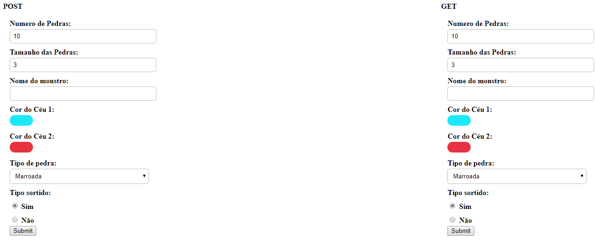
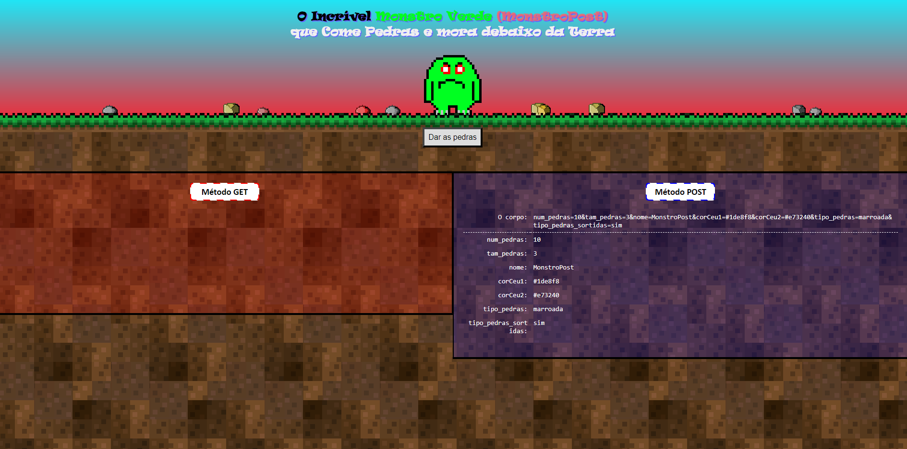
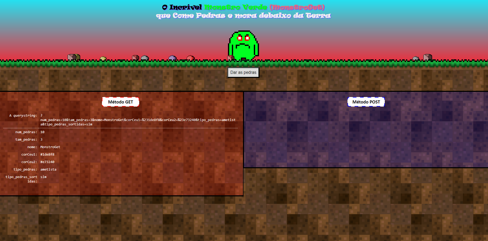

# Programação Web - Formulário Terrível!

_Formulário terrível, terrível!_

O terrível monstro verde (etc. etc.) está com fome e você deve dar comida para ele. Ele acaba de ir para a superfície e para que ele não comece a comer pessoas, você deve dar a ele seu segundo alimento preferido: pedras.

Para isso, devemos ir até onde ele está e enviar algumas pedras para ele. Atualmente, ele está neste endereço: http://terrivel.herokuapp.com/monster. Para dar comida a ele, você deve encomendá-las a partir de um formulário html.

# Resultado

## Formulário

## POST

## GET

